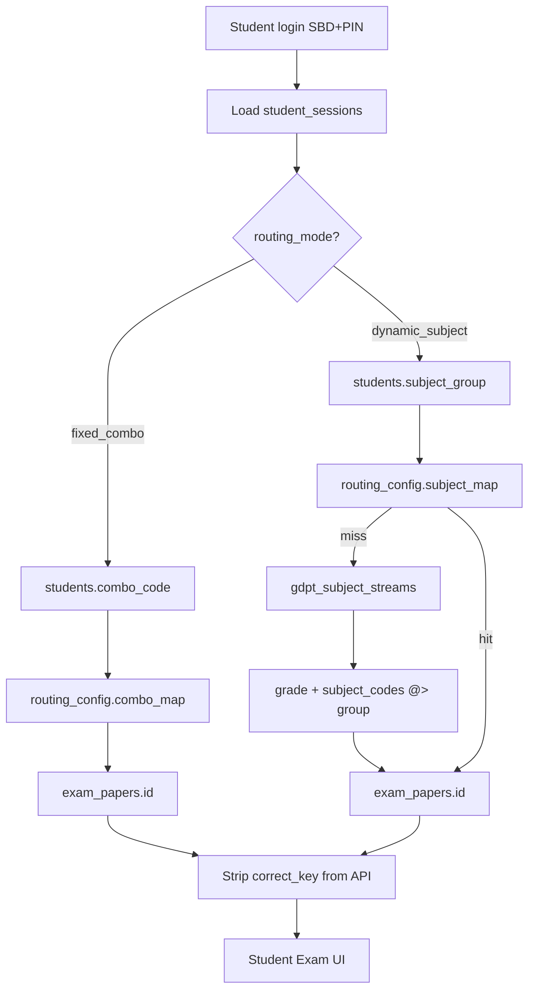

# VNU Edge Exam — Thiết kế CSDL PostgreSQL

Tài liệu ERD và mô tả schema cho hệ thống thi trắc nghiệm LAN.  
Đặc biệt tập trung: **JSONB định tuyến môn thi**, **Audit Log**, **phân luồng GDPT 2018**.

---

## 1. Sơ đồ ERD tổng thể

```mermaid
erDiagram
    schools ||--o{ classes : has
    schools ||--o{ students : has
    classes ||--o{ students : enrolls

    exam_sessions ||--o{ exam_papers : contains
    exam_sessions ||--o{ student_sessions : schedules
    exam_sessions ||--o{ gdpt_subject_streams : "GDPT streams"
    exam_sessions ||--o{ audit_logs : traces
    exam_sessions ||--o{ proctor_actions : records
    exam_sessions ||--o{ anonymization_map : masks

    students ||--o{ student_sessions : takes
    exam_papers ||--o{ student_sessions : assigned
    exam_papers ||--o{ gdpt_subject_streams : "paper per stream"

    student_sessions ||--o{ audit_logs : generates
    student_sessions ||--o{ proctor_actions : receives
    student_sessions ||--o{ grading_flags : flags

    question_bank ||--o{ difficulty_stats : calibrates

    schools {
        uuid id PK
        varchar name
        varchar code
        timestamptz createdAt
    }

    students {
        uuid id PK
        varchar fullName
        varchar combo_code "TN THPT tổ hợp"
        varchar subject_group "GDPT ban môn"
        uuid school_id FK
        uuid class_id FK
    }

    exam_sessions {
        uuid id PK
        varchar name
        varchar routing_mode "fixed_combo | dynamic_subject"
        jsonb rules "Chấm điểm, proctoring, UI"
        jsonb routing_config "Map định tuyến động"
        timestamptz start_at
        int duration_min
        varchar status
    }

    gdpt_subject_streams {
        uuid id PK
        uuid exam_session_id FK
        varchar stream_code UK
        varchar stream_name
        varchar grade "10|11|12"
        jsonb subject_codes "Môn trong luồng"
        jsonb stream_config "Giờ, UI mode"
        uuid exam_paper_id FK
    }

    exam_papers {
        uuid id PK
        uuid exam_session_id FK
        varchar subject
        varchar combo_code
        jsonb questions "Snapshot đề, có correct_key"
        jsonb difficulty_meta
    }

    student_sessions {
        uuid id PK
        varchar sbd UK_per_session
        varchar pin_hash
        varchar bound_ip
        uuid student_id FK
        uuid exam_session_id FK
        uuid exam_paper_id FK
        enum status
        jsonb answers
        jsonb violations
        jsonb scoreResult
    }

    audit_logs {
        uuid id PK
        uuid exam_session_id FK
        uuid student_session_id FK
        enum eventType
        jsonb payload
        varchar ip
        timestamptz createdAt
    }

    question_bank {
        uuid id PK
        varchar subject
        enum type
        enum difficulty
        jsonb content
        jsonb correct_key
    }
```

---

## 2. Nhóm bảng theo domain

| Domain | Bảng | Vai trò |
|--------|------|---------|
| **Tổ chức** | `schools`, `classes`, `students` | Học sinh, tổ hợp TN THPT (`combo_code`), ban môn GDPT (`subject_group`) |
| **Ca thi & định tuyến** | `exam_sessions`, `gdpt_subject_streams`, `exam_papers` | Cấu hình ca, phân luồng GDPT, đề đã sinh |
| **Runtime thi** | `student_sessions` | Phiên thi: auth, IP, answers, violations |
| **Giám sát** | `audit_logs`, `proctor_actions` | Vết audit + thao tác giám thị |
| **Ngân hàng đề** | `question_bank`, `media_assets` | Câu hỏi WYSIWYG/KaTeX, file vật lý |
| **Hậu kỳ** | `grading_flags`, `anonymization_map`, `difficulty_stats` | Chấm thủ công, rọc phách, hiệu chỉnh độ khó |

---

## 3. JSONB — Cấu hình động

### 3.1 `exam_sessions.rules` — Luật thi & giao diện

Dùng cho chấm điểm, proctoring, UI — **không** chứa logic định tuyến paper.

```json
{
  "exam_type": "TN_THPT_2025",
  "subjects": [
    {
      "code": "MATH",
      "weight": 3,
      "parts": ["part1_mcq", "part2_truefalse", "part3_short"],
      "ui_mode": "vertical_focus"
    },
    {
      "code": "LITERATURE",
      "weight": 2,
      "ui_mode": "split_view"
    }
  ],
  "scoring": {
    "true_false_branch": { "1": 0.1, "2": 0.25, "3": 0.5, "4": 1.0 },
    "short_answer_normalize": ["comma_to_dot", "trim_whitespace"]
  },
  "proctoring": {
    "max_focus_violations": 3,
    "autosave_interval_sec": 3
  },
  "audio": {
    "max_plays": 2,
    "seek_disabled": true
  }
}
```

**Index:** `GIN (rules)` — truy vấn `rules @> '{"exam_type":"GDPT_2018"}'`.

---

### 3.2 `exam_sessions.routing_config` — Bộ định tuyến môn thi

Tách riêng để Admin đổi map đề **không** đụng luật chấm điểm.

#### TN THPT 2025 (`routing_mode = fixed_combo`)

```json
{
  "mode": "fixed_combo",
  "resolve_order": ["combo_code"],
  "combo_map": {
    "A00": "uuid-paper-toan-ly-hoa",
    "D01": "uuid-paper-van-su-dia",
    "B00": "uuid-paper-toan-hoa-sinh"
  },
  "default_paper_id": null
}
```

**Luồng resolve:** `students.combo_code` → `combo_map[combo_code]` → `exam_papers.id`.

#### GDPT 2018 — Kiểm tra định kỳ (`routing_mode = dynamic_subject`)

```json
{
  "mode": "dynamic_subject",
  "resolve_order": ["subject_group", "grade_stream"],
  "subject_map": {
    "MATH": "uuid-paper-toan-10",
    "LITERATURE": "uuid-paper-van-10",
    "PHYSICS": "uuid-paper-ly-11"
  },
  "default_paper_id": "uuid-paper-du-phong"
}
```

**Luồng resolve:** `students.subject_group` → `subject_map` → nếu không có, tra `gdpt_subject_streams` theo `grade` + `subject_codes`.

**Index:** `GIN (routing_config)`.

---

### 3.3 `gdpt_subject_streams` — Phân luồng ca thi GDPT 2018

Bảng quan hệ chuẩn hóa (không chỉ JSONB) để quản lý **nhiều ban/khối trong cùng một ca thi**.

| Cột | Kiểu | Mô tả |
|-----|------|-------|
| `stream_code` | VARCHAR | `BAN_TOAN_TIN_12`, `BAN_VAN_SU_DIA_11` |
| `grade` | VARCHAR | Khối 10 / 11 / 12 |
| `subject_codes` | JSONB | `["MATH","INFORMATICS"]` |
| `stream_config` | JSONB | Giờ riêng, UI mode |
| `exam_paper_id` | UUID FK | Đề gắn với luồng |

**Ví dụ `stream_config`:**

```json
{
  "time_offset_min": 0,
  "duration_min": 45,
  "ui_mode": "vertical_focus",
  "room_hint": "P101-P120"
}
```

**Ví dụ dữ liệu ca thi GDPT lớp 12:**

| stream_code | grade | subject_codes | exam_paper_id |
|-------------|-------|---------------|---------------|
| BAN_TOAN_TIN_12 | 12 | ["MATH","INFORMATICS"] | paper-001 |
| BAN_VAN_SU_DIA_12 | 12 | ["LITERATURE","HISTORY","GEOGRAPHY"] | paper-002 |
| BAN_ANH_12 | 12 | ["ENGLISH"] | paper-003 |

**Index:** `UNIQUE(exam_session_id, stream_code)`, `GIN(subject_codes)`.

---

### 3.4 Các JSONB runtime khác

| Bảng | Cột | Mục đích |
|------|-----|----------|
| `student_sessions` | `answers` | `{ "questionId": "A" \| [true,false,...] \| "3.14" }` |
| `student_sessions` | `violations` | `{ "count": 2, "events": [{ "at": "...", "reason": "visibility_hidden" }] }` |
| `student_sessions` | `scoreResult` | `{ "total": 7.5, "breakdown": [...] }` — chỉ sau submit |
| `exam_papers` | `questions` | Snapshot đề sau Fisher-Yates, **có `correct_key` server-only** |
| `question_bank` | `content` | `{ "stem": "$x^2+1$", "options": [...], "passage": "..." }` |
| `audit_logs` | `payload` | Metadata sự kiện (xem mục 4) |

---

## 4. Audit Log — Thiết kế chi tiết

### 4.1 Schema

```sql
CREATE TYPE audit_event_type_enum AS ENUM (
  'login', 'click', 'focus_lost', 'focus_violation',
  'autosave', 'submit', 'proctor_action', 'fullscreen_exit'
);

CREATE TABLE audit_logs (
  id                  UUID PRIMARY KEY DEFAULT uuid_generate_v4(),
  exam_session_id     UUID REFERENCES exam_sessions(id),
  student_session_id  UUID REFERENCES student_sessions(id),
  "eventType"         audit_event_type_enum NOT NULL,
  payload             JSONB DEFAULT '{}',
  ip                  VARCHAR(45),          -- IPv4/IPv6 vật lý
  "createdAt"         TIMESTAMPTZ DEFAULT NOW()
);
```

### 4.2 Index chiến lược

| Index | Mục đích |
|-------|----------|
| `(exam_session_id, createdAt DESC)` | Timeline ca thi |
| `(student_session_id, createdAt DESC)` | Truy vết từng thí sinh |
| `(eventType, createdAt DESC)` | Lọc vi phạm / submit |
| `GIN (payload)` | `payload @> '{"target":"q-5"}'` |
| `(ip) WHERE ip IS NOT NULL` | Đối chiếu máy trạm |

### 4.3 Payload mẫu theo `eventType`

```json
// login
{ "sbd": "1001" }

// click
{ "target": "q-12", "element": "option-B" }

// focus_violation
{ "count": 2, "reason": "visibility_hidden" }

// autosave
{ "answer_count": 15 }

// submit
{ "total": 8.25 }

// proctor_action
{ "action": "extend_time", "minutes": 5, "proctor_id": "gt-01" }

// fullscreen_exit
{ "fullscreen": false }
```

### 4.4 Phân vùng (khuyến nghị production)

```sql
-- Partition theo tháng khi > 10M dòng
CREATE TABLE audit_logs_2025_06 PARTITION OF audit_logs
  FOR VALUES FROM ('2025-06-01') TO ('2025-07-01');
```

---

## 5. Luồng định tuyến đa nhiệm



---

## 6. Ràng buộc & bảo mật

| Quy tắc | Implementation |
|---------|----------------|
| Không leak `correct_key` | `exam_papers.questions` chỉ đọc server-side khi chấm; API student strip field |
| IP binding | `student_sessions.bound_ip` ghi lần đầu login; guard so khớp mỗi request |
| SBD unique trong ca | `UNIQUE(sbd, exam_session_id)` — khuyến nghị thêm |
| Rọc phách | `anonymization_map.hash_code` = SHA-256(student_id + session + salt) |
| `correct_key` ngân hàng đề | `question_bank.correct_key` — không bao giờ join vào API edge |

---

## 7. Bảng QĐ 764 (migration 171950)

| Bảng | Vai trò |
|------|---------|
| `exam_structure_templates` | Ma trận đề chuẩn QĐ 764 — dùng chung TN THPT + GK/CK |
| `question_clusters` | Câu chùm Tiếng Anh (passage + câu con) |
| `tnpt_combo_catalog` | 36 tổ hợp TN THPT 2025 |
| `student_subject_slots` | Lịch thi cá nhân hóa TN THPT (ca/môn) |
| `gdpt_subject_streams` | + `assessment_period`, `structure_template_id` |

Xem [JSONB-contracts.md](./JSONB-contracts.md) cho schema chi tiết.

---

## 8. File tham chiếu trong repo

| File | Nội dung |
|------|----------|
| [schema.sql](./schema.sql) | DDL đầy đủ + comment |
| [JSONB-contracts.md](./JSONB-contracts.md) | Hợp đồng JSONB rules, parts, routing |
| [apps/api/src/database/entities/](../../apps/api/src/database/entities/) | TypeORM entities |
| [apps/api/src/database/migrations/](../../apps/api/src/database/migrations/) | Migrations |
| [packages/shared-types/src/](../../packages/shared-types/src/) | Types + scoring engine |

---

## 9. Enum tham chiếu

```
routing_mode          : fixed_combo | dynamic_subject
exam_type (in rules)  : TN_THPT_2025 | GDPT_2018
assessment_period     : GK1 | GK2 | CK1 | CK2
structure_source      : QD764 | custom
question_type         : mcq | true_false | short_answer | essay | cluster_mcq
difficulty            : low | medium | high
student_session_status: NOT_LOGGED_IN | ACTIVE | OFFLINE | CHEATING | LOCKED | SUBMITTED
audit_event_type      : login | click | focus_lost | focus_violation | autosave | submit | proctor_action | fullscreen_exit
proctor_action_type   : lock_exam | extend_time | force_submit | reset_session
```
